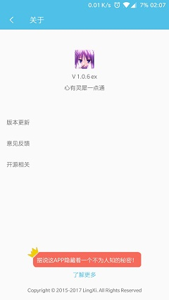

# 关于灵悉  

个人兴趣项目，此代码为app端代码  

目前项目已能正常使用，包括融云token接入、头像上传等功能

项目也一直在变，坚持全凭兴趣，服务端查看[灵悉-server](https://github.com/happycao/lingxi-server)

移除了okgo，因使用场景单一，只做了post请求封装，如有更多需求请选择更好的轮子  

Glide版本4.1.1，与之对应PhotoPicker版本0.9.12、glide-transformations版本3.0.1

调试请使用alpha版本，local版本为本人本地使用，online版本为发布打包版本

体验请直接点击下载打包版本[点击下载测试版](http://47.100.245.128/download/lingxi-text.apk)

如果不是用于测试，欢迎来正式版一起玩耍[点击下载正式版](http://47.100.245.128/download/lingxi.apk)

## 灵悉简介  

- 生无彩凤双飞翼，心有灵犀一点通  

- 依托于社交群组，好友向社交圈，供用户吐槽交流  

- 用户注册登陆  

- 动态发布点赞评论  

- 单聊聊天室  

- app更新  

- Toast彩蛋  

- 个人信息修改(待办)  

### 截图展示

## 反馈与建议
- 微博：[种下一枚种子](http://weibo.com/374845241)
- QQ：986417980
- 交流群：387355490

感谢阅读这份文档。
