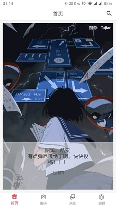
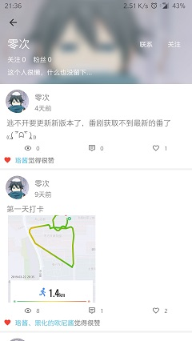

# 关于灵悉  

个人兴趣项目，此代码为app端代码  

目前项目处于重构中，包括融云token接入、头像上传等功能无法使用

项目也一直在变，坚持全凭兴趣，服务端查看[灵悉-server](https://github.com/happycao/lingxi-server)

调试请使用alpha版本，local版本为本人本地使用，online版本为发布打包版本  

移除了okgo，因使用场景单一，只做了post请求封装，如有更多需求请选择更好的轮子  

服务器已经迁移，之前的服务器将在六月来临之际关闭，请留意

体验请直接点击下载打包版本[点我下载](http://47.100.245.128/download/lingxi.apk)

## 灵悉简介  

- 生无彩凤双飞翼，心有灵犀一点通  

- 依托于社交群组，好友向社交圈，供用户吐槽交流  

- 用户注册登陆  

- 动态发布点赞评论  

- 单聊聊天室  

- app更新  

- Toast彩蛋  

- 个人信息修改(待办)  

### 截图展示

## 反馈与建议
- 微博：[种下一枚种子](http://weibo.com/374845241)
- QQ：986417980
- 交流群：387355490

感谢阅读这份文档。
