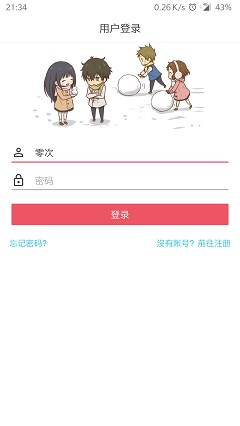
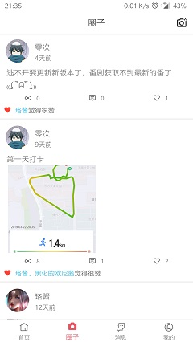

## 关于灵悉  
  
个人兴趣项目，此代码为app端代码  
当前版本包含番剧展示，用户注册登录，修改头像，写给未来，动态发布，评论回复，查看我的回复、与我相关等  
项目一直在无规律更新，坚持全凭兴趣，服务端查看[灵悉-server](https://github.com/happycao/lingxi-server)  
网络为OkHttp，只做了简单的get及post请求封装，如有更多需求请选择更好的轮子
Glide版本4.1.1，与之对应PhotoPicker版本0.9.12、glide-transformations版本3.0.1
支持exoPlayer播放视频，基于原UI并做了简单的修改，支持全屏播放
调试请使用alpha版本，local版本为本人本地使用，online版本为发布打包版本  
体验请直接点击下载打包版本[点击下载测试版](http://47.100.245.128/download/lingxi-test.apk)  
如果不是用于测试，欢迎来正式版一起玩耍[点击下载正式版](http://47.100.245.128/download/lingxi.apk)  

**[19/04/22]**
1、引入exoPlayer播放视频
2、移除~~嘀哩嘀哩~~接口的webView的视频播放，并创建了旧版分支[v_dd分支](https://github.com/happycao/lingxi-android/tree/v_dd)

**[19/03/31]**  
1、更新白色主题  
2、update gradle 4.6
  
**[18/08 - 18/10]**
1、移除jsoup，首页番剧改变
2、新增写给未来功能  
  
**[18/07/13]**  
1、主干版本移除了融云即时通讯，需要包含融云单聊版本的访问[v_im分支](https://github.com/happycao/lingxi-android/tree/v_im)
  
### 灵悉相关
  
- 生无彩凤双飞翼，心有灵犀一点通  
- 依托于社交群组，好友向社交圈，供用户吐槽交流  
- [x] 用户注册登陆  
- [x] 解析网页以瀑布流展示番剧  
- [x] 网页视频播放支持全屏  
- [x] 动态发布点赞评论  
- [x] 写给未来的信  
- [x] 分享链接到灵悉  
- [x] ~~app内更新~~现采用获取到更新前往浏览器更新的模式  
- [x] Toast彩蛋  
- [ ] 个人信息修改  
- [ ] 动态发布支持话题  
- [ ] 动态支持@用户  
  
### 截图展示  

  
## 反馈与建议  
- 微博：[iHappyCL](http://weibo.com/374845241)  
- QQ：986417980  
- 交流群：387355490  
  
欢迎star，感谢阅读这份文档。  